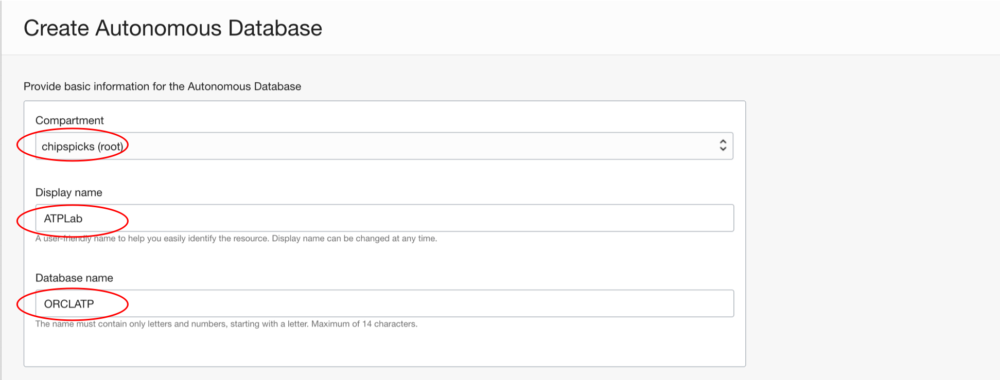
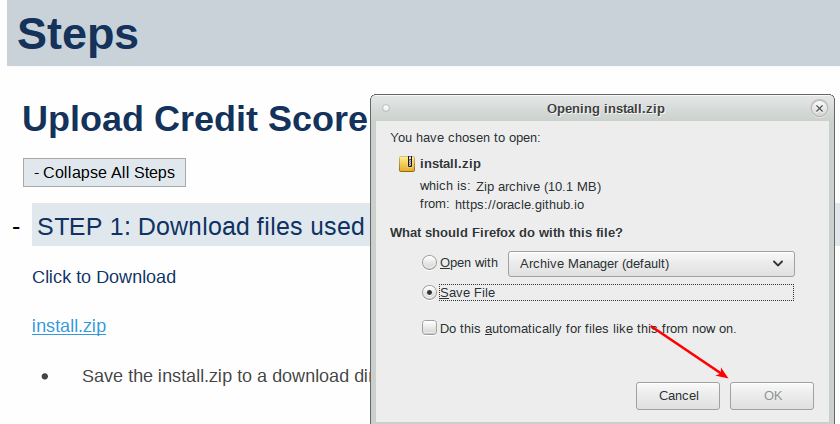
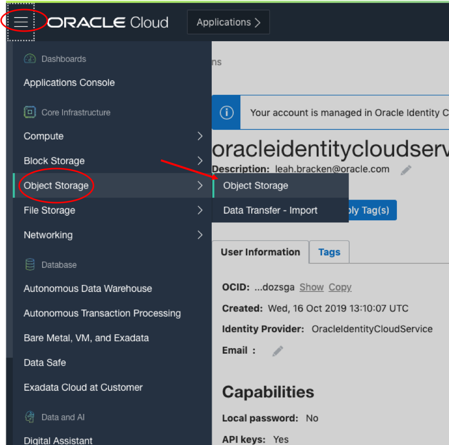
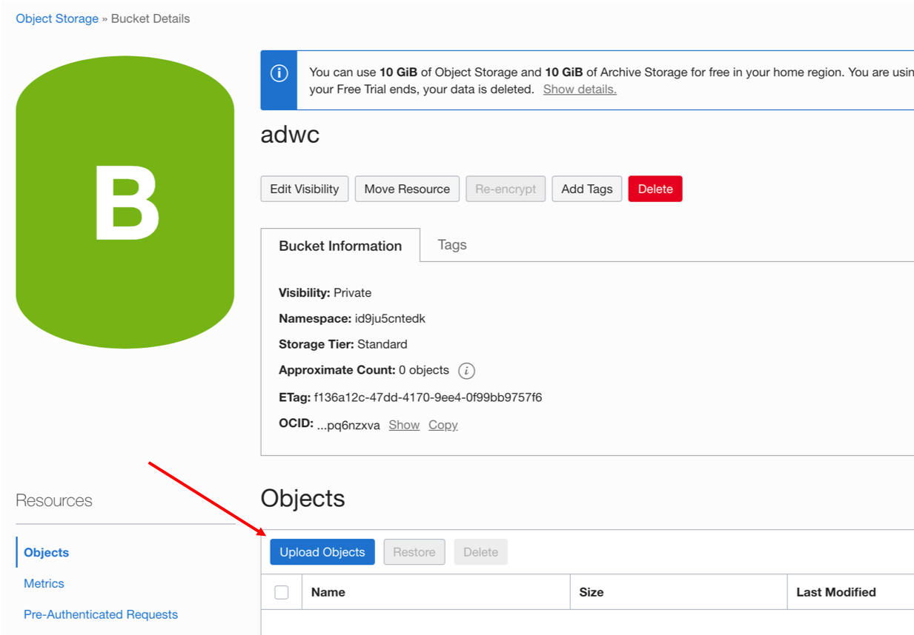

# Introduction and Setup

## Backgound Challenges

In this lab you will assume the role of Alphaoffice's DBA Vijay.  Vijay has some experience with another large cloud vendor, and has been getting aclimated to the cloud computing model.  In his initial experience with the other provider he found it a bit confusing to get his head around the large number of services, most of which he was not interested in.  Alphaoffice has been using RAC on premise, and this was not supported.  He also found that many of the DBA management tasks still needed to be tended to, while trying to keep up with new projects.  The latest project was initiated by marketing, and involves building out a data warehouse with sales, order, marketing, and other data.  While evaluating the other cloud vendor he found that creating a database was simple, but he had many other challenges. This includes:
-   Data must be loaded so as to distribute data evenly to optimize performance.  This requires pre-processing of the data, which considering the data volumes is very time consuming.
-   Query patterns needed to be established in advance so that sort keys could be created to optimize performance.  Again, this was time consuming, and presumed advance knowledge of how data was to be accessed.  The whole point of the data warehouse for Alphaoffice was to provide the ability to query data any which way without worrying about how it was stored.  The premise of true data exploration assumes unanticipated new and unique ways of looking at your data so that patterns can be discovered.  The advanced processing was very time consuming, while limiting what you could do with it.
-   Data updates necessitated lengthy data re-organization processes due to degrading performance.
-   Often queries were innefficient either due to a sub-optimal execution plan, or data movement as part of a broadcast or redistribution activity.  To further complicate this situation column width specifications also may impact performance, whereby temporary tables are uncompressed at query execution time.
-   Heather, the data scientist is tasked with creating some predictive models on the customer credit data.  This is in the Data Warehouse, but is no out of the box machine learning capabilities in the cloud database.  Their recommendation is to engage a partner.  Heather prefers a self service model, and in any case, there is a concern about the data volume to be analyzed.
-   Vijay has been very concerned about whether his team can meet the aggressive deadline requested by Marketing.  Typically DW development involves sizing, indexing, partitioning, and other activities.  On top of this the cloud vendors also cite all the other considerations noted above.

## Why Oracle?

Having some experience with on-premise Oracle databases Vijay knows that most of the competing cloud vendor database features were available in Oracle many years ago (decades ago in some cases, such as the cost based optimized in 1992 which has been improved and enhanced for the past 26 years).  Virtually every feature available in other cloud vendor databases has been available in the Oracle database for many years, so it was some of the newer Oracle features that interested Vijay.  Alphaoffice had not yet looked at Exadata (perhaps the most successful technical innovation in the Oracle database to date), which is the underpinnings of Oracle's ADWC solution.  In particular he was interested in:
-   **Hands off overall design**:  This will free up much of their time to support rapid project delivery.
    -   Easy (automated provisioning, backups, patching, upgrades, and performance tuning).
    -   Fast (parallelism, columnar processing, and compression).
    -   Elastic (Elastic scaling of compute and storage, without downtime, pay only for resources consumed).
-   **Built in Machine Learning algorithms**:  Most of the popular machine learning algorithms that are used by data scientists are supported in ADWC, avoiding the need to move and copy the data back and forth.  This greatly simplifies the mining process and leverages the speed and computing capacity of the database, enabling analysis of billions of rows of data in minutes or seconds.  
-   **'Load and Go'**:  No need to spend time designing in performance features such as indexes and/or partitions.  You just 'load and go'.  This will be a huge time saving.
-   **Smart Flash Cache**: PCI flash cards that provide faster access than standard, disk-based access.
-   **Storage Indexes and Smart Scan**: A Storage Index maintains summary information about database table data down on the storage servers. Unlike row and column projections, storage indexes have an additional advantage in that they actually avoid disk I/O entirely, as opposed to simply reducing data transfers to database servers.  The Storage Indexes are created automatically and transparently based on the SQL predicate and join information executed by Oracle and passed down to the storage servers from the database servers.
-   **Compatibility**:  ADWC is compatible with most of the existing development and analytical tools, so there are no adverse downstream dependencies to taking this approach.

Vijay notes that none of these features that are not available in any other commercial or open source database require any of his team's time to implement, and should dramatically improve performance and enable true ad-hoc access to terrebytes of data.  He is eager to prove this out.

## Lab Introduction
This lab walks you through the steps to get started using the Oracle Autonomous Data Warehouse Cloud (ADWC) on Oracle Infrastructure Cloud (OCI). You will provision a new ADWC database and connect to the database using Oracle SQL Developer.  Note throughout all the labs you may see small differences between what you see in your accounts and the results of various steps due to cloud product updates and the fact that not all steps are deterministic (queries use sampling).

To log issues and view the Lab Guide source, go to the [github oracle](https://github.com/oracle/learning-library/tree/master/workshops/adwc4dev) repository.

## Objectives
-   Learn how to provision an ADWC instance
-   Learn how to provision an ATP instance
-   Learn how to connect to ADWC

## Required Artifacts
- The following lab requires an Oracle Public Cloud account. You may use your own cloud account, a cloud account that you obtained through a trial, or a training account whose details were given to you by an Oracle instructor.
-   Oracle SQL Developer 18.3 (see [Oracle Technology Network download site](http://www.oracle.com/technetwork/developer-tools/sql-developer/overview/index.html)).
    Please be sure to use SQL Developer version 18.3 or later because this version contains enhancements for key Autonomous DW Cloud features.

    **Note**: If you are a Windows user on 64-bit platform, download the 'Windows 64-bit with JDK 8 included' distribution as it includes both Java 8 and the Java Cryptography Extension (JCE) files necessary to run SQL Developer and connect to your Autonomous DW Cloud.
    If you are a non-Windows user, download and install the appropriate [Java 8 JDK](http://www.oracle.com/technetwork/java/javase/downloads/jdk8-downloads-2133151.html) for your Operating System. Download and extract the [Java Cryptography Encryption Archive](http://www.oracle.com/technetwork/java/javase/downloads/jce8-download-2133166.html) to the directory as indicated in the README.txt.

**Note:** You may see differences in account details (eg: Compartment Name is different in different places) as you work through the labs.  This is because the workshop was developed using different accounts over time.

In this section you will be provisioning an ADWC database using the cloud console.

## **Step 1:** Sign in to Oracle Cloud

- Go to [cloud.oracle.com](https://cloud.oracle.com), click `View Accounts` to sign in with your Oracle Cloud account.

  

- Click `Sign in to Cloud` to sign in with your Oracle Cloud account.

  

- Enter your `Cloud Account Name` and click `Next`.

  

- Enter your Cloud `username` and `password`, and click `Sign In`.

  

## **Step 2:** Create an ADWC and ATP Instances

First, we are going to create an ADWC Instance:

- Search for Autonomous Data Warehouse and click on it

  

- Select Create Autonomous Data Warehouse

  

- Enter Select `Compartment` (yours will be different - do not select `ManagedCompartmentforPaaS`) and then enter `Display Name`, `Database Name`.

  

- Under `Choose a workload type` and `Choose a deployment type`, select `Data Warehouse` and `Shared Infrastructure`

  

- Under `Configure the database`, leave `Choose database version` and `Storage (TB)` as it is but increase `OCPU Count` to 2.

  

- Add a password (`Alpha2018___` three underscores).

  

- Under `Choose a license type`, select   `License Included` and then select `Create Autonomous Database`.

  

- Once it finishes provisioning, you can click on the instance name to see details of it

  

  

You now have created your first Autonomous Data Warehouse Cloud instance. Now,
we are going to very similar steps to create an Autonomous DataBase

- Click on the side menu and select Autonoous Transaction processing

  

- Select Create Autonomous Database

  

  - Enter Select `Compartment` (yours will be different - do not select `ManagedCompartmentforPaaS`) and then enter `Display Name`, `Database Name`.

    

- Under `Choose a workload type` and `Choose a deployment type`, select `Transaction Processing` and `Shared Infrastructure`

    

- Under `Configure the database`, leave `Choose database version` and `Storage (TB)` as it is but increase `OCPU Count` to 2.

    

- Add a password (`Alpha2018___` three underscores).

    

- Under `Choose a license type`, select   `License Included` and then select `Create Autonomous Database`.

    

- Once it finishes provisioning, you can click on the instance name to see details of it

    

    

You now have created your first Autonomous Database Cloud instance.

## **Step 3:** Download the credentials wallet

- In the instance details page find your database and click Service Console.

    

- Click on `Administration` and click `Download a Connection Wallet`

    

    

- Specify a password of your choice for the wallet (eg Alpha2018___), you will need this password when connecting to the database later. Click Download to download the wallet file to your client machine

    

## **Step 4:** Download Files Used in Lab 200

**Click to Download**

[install.zip](https://oracle.github.io/learning-library/workshops/adwc4dev/install/install.zip)

- Save the install.zip to a download directory and then unzip the file.

  

## **Step 5:** Create a bucket adwc and upload your data

- Select the drop down menu in the upper left, scroll down and select Object Storage.

  

- Create a bucket called `adwc`.  Create the bucket in your compartment (not ManagedCompartmentForPaas).

  

  

- Select the `adwc` bucket and upload file `credit_scoring_100k` in git directory `ADWC4Dev/workshops/adwc4dev/install`.

  

  

  

  

  

- Copy the URL to a notepad for the following import process.

  

  

- To load data from the Oracle Cloud Infrastructure(OCI) Object Storage you will need an OCI user with the appropriate privileges to read data (or upload) data to the Object Store. The communication between the database and the object store relies on the Swift protocol and the OCI user Auth Token.  Go back to the menu and select users.

  

- Click the user's name to view the details. Also, remember the username as you will need that in the next step.

  

- On the left side of the page, click Auth Tokens, and then `Generate Token`.  Call it `adwc_token`.  Be sure to copy it to a notepad.

  

  

  

  

## **Step 6:** Log in to SQL Developer Web

## **Step 7:** Create a Database Credential for Your Users
