# Introduction and Setup

## Backgound Challenges

In this lab you will assume the role of Alphaoffice's DBA Vijay.  Vijay has some experience with another large cloud vendor, and has been getting aclimated to the cloud computing model.  In his initial experience with the other provider he found it a bit confusing to get his head around the large number of services, most of which he was not interested in.  Alphaoffice has been using RAC on premise, and this was not supported.  He also found that many of the DBA management tasks still needed to be tended to, while trying to keep up with new projects.  The latest project was initiated by marketing, and involves building out a data warehouse with sales, order, marketing, and other data.  While evaluating the other cloud vendor he found that creating a database was simple, but he had many other challenges. This includes:
-   Data must be loaded so as to distribute data evenly to optimize performance.  This requires pre-processing of the data, which considering the data volumes is very time consuming.
-   Query patterns needed to be established in advance so that sort keys could be created to optimize performance.  Again, this was time consuming, and presumed advance knowledge of how data was to be accessed.  The whole point of the data warehouse for Alphaoffice was to provide the ability to query data any which way without worrying about how it was stored.  The premise of true data exploration assumes unanticipated new and unique ways of looking at your data so that patterns can be discovered.  The advanced processing was very time consuming, while limiting what you could do with it.
-   Data updates necessitated lengthy data re-organization processes due to degrading performance.
-   Often queries were innefficient either due to a sub-optimal execution plan, or data movement as part of a broadcast or redistribution activity.  To further complicate this situation column width specifications also may impact performance, whereby temporary tables are uncompressed at query execution time.
-   Heather, the data scientist is tasked with creating some predictive models on the customer credit data.  This is in the Data Warehouse, but is no out of the box machine learning capabilities in the cloud database.  Their recommendation is to engage a partner.  Heather prefers a self service model, and in any case, there is a concern about the data volume to be analyzed.
-   Vijay has been very concerned about whether his team can meet the aggressive deadline requested by Marketing.  Typically DW development involves sizing, indexing, partitioning, and other activities.  On top of this the cloud vendors also cite all the other considerations noted above.

## Why Oracle?

Having some experience with on-premise Oracle databases Vijay knows that most of the competing cloud vendor database features were available in Oracle many years ago (decades ago in some cases, such as the cost based optimized in 1992 which has been improved and enhanced for the past 26 years).  Virtually every feature available in other cloud vendor databases has been available in the Oracle database for many years, so it was some of the newer Oracle features that interested Vijay.  Alphaoffice had not yet looked at Exadata (perhaps the most successful technical innovation in the Oracle database to date), which is the underpinnings of Oracle's ADWC solution.  In particular he was interested in:
-   **Hands off overall design**:  This will free up much of their time to support rapid project delivery.
    -   Easy (automated provisioning, backups, patching, upgrades, and performance tuning).
    -   Fast (parallelism, columnar processing, and compression).
    -   Elastic (Elastic scaling of compute and storage, without downtime, pay only for resources consumed).
-   **Built in Machine Learning algorithms**:  Most of the popular machine learning algorithms that are used by data scientists are supported in ADWC, avoiding the need to move and copy the data back and forth.  This greatly simplifies the mining process and leverages the speed and computing capacity of the database, enabling analysis of billions of rows of data in minutes or seconds.  
-   **'Load and Go'**:  No need to spend time designing in performance features such as indexes and/or partitions.  You just 'load and go'.  This will be a huge time saving.
-   **Smart Flash Cache**: PCI flash cards that provide faster access than standard, disk-based access.
-   **Storage Indexes and Smart Scan**: A Storage Index maintains summary information about database table data down on the storage servers. Unlike row and column projections, storage indexes have an additional advantage in that they actually avoid disk I/O entirely, as opposed to simply reducing data transfers to database servers.  The Storage Indexes are created automatically and transparently based on the SQL predicate and join information executed by Oracle and passed down to the storage servers from the database servers.
-   **Compatibility**:  ADWC is compatible with most of the existing development and analytical tools, so there are no adverse downstream dependencies to taking this approach.

Vijay notes that none of these features that are not available in any other commercial or open source database require any of his team's time to implement, and should dramatically improve performance and enable true ad-hoc access to terrebytes of data.  He is eager to prove this out.

## Lab Introduction
This lab walks you through the steps to get started using the Oracle Autonomous Data Warehouse Cloud (ADWC) on Oracle Infrastructure Cloud (OCI). You will provision a new ADWC database and connect to the database using Oracle SQL Developer.  Note throughout all the labs you may see small differences between what you see in your accounts and the results of various steps due to cloud product updates and the fact that not all steps are deterministic (queries use sampling).

To log issues and view the Lab Guide source, go to the [github oracle](https://github.com/oracle/learning-library/tree/master/workshops/adwc4dev) repository.

## Objectives
-   Learn how to provision an ADWC instance
-   Learn how to provision an ATP instance
-   Learn how to connect to ADWC

## Required Artifacts
- The following lab requires an Oracle Public Cloud account. You may use your own cloud account, a cloud account that you obtained through a trial, or a training account whose details were given to you by an Oracle instructor.


**Note:** You may see differences in account details (eg: Compartment Name is different in different places) as you work through the labs.  This is because the workshop was developed using different accounts over time.

In this section you will be provisioning an ADWC database and an ATP database using the cloud console.

## **Step 1:** Sign in to Oracle Cloud

- Go to [cloud.oracle.com](https://cloud.oracle.com), click `View Accounts` to sign in with your Oracle Cloud account.

  

- Click `Sign in to Cloud` to sign in with your Oracle Cloud account.

  

- Enter your `Cloud Account Name` and click `Next`.

  

- Enter your Cloud `username` and `password`, and click `Sign In`.

  


## **Step 2:** Create an ADWC and ATP Instances

First, we are going to create an ADWC Instance:

- Search for Autonomous Data Warehouse and click on it

  


- Select Create Autonomous Data Warehouse

  

- Enter Select `Compartment` (yours will be different - do not select `ManagedCompartmentforPaaS`) and then enter `Display Name`, `Database Name`.

  

- Under `Choose a workload type` and `Choose a deployment type`, select `Data Warehouse` and `Shared Infrastructure`

  

- Under `Configure the database`, leave `Choose database version` and `Storage (TB)` as it is but increase `OCPU Count` to 2.

  

- Add a password. Note the password down in a notepad, you will need it later in Lab 2.

  


- Under `Choose a license type`, select   `License Included` and then select `Create Autonomous Database`.

  

- Once it finishes provisioning, you can click on the instance name to see details of it

  

  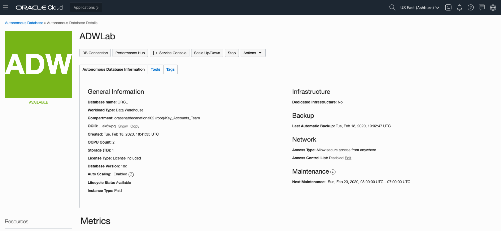

You now have created your first Autonomous Data Warehouse Cloud instance. Now,
we are going to very similar steps to create an Autonomous DataBase

- Click on the side menu and select Autonoous Transaction processing

  

- Select Create Autonomous Database

  

  - Enter Select `Compartment` (yours will be different - do not select `ManagedCompartmentforPaaS`) and then enter `Display Name`, `Database Name`.

    

- Under `Choose a workload type` and `Choose a deployment type`, select `Transaction Processing` and `Shared Infrastructure`

    

- Under `Configure the database`, leave `Choose database version` and `Storage (TB)` as it is but increase `OCPU Count` to 2.

    

- Add a password. Note the password down in a notepad, you will need it later in Lab 2.

    


- Under `Choose a license type`, select   `Bring Your Own License (BYOL)` and then select `Create Autonomous Database`.

    

- Once it finishes provisioning, you can click on the instance name to see details of it

    

    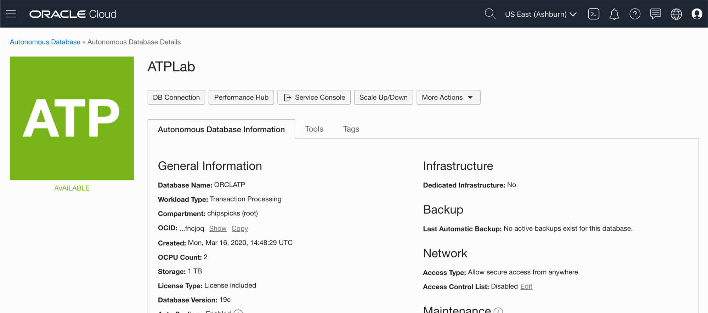

You now have created your first Autonomous Database Cloud instance.

## **Step 3:** Download the credentials wallet

- Click the menu bar and navigate to the ADW Instance you created in Step 2.

    

    

- In the instance details page find your database and click Service Console.

    

- Click on `Administration` and click `Download a Connection Wallet`

    

    

- Specify a password of your choice for the wallet. You will need this password when connecting to the database later. Click Download to download the wallet file to your client machine

    

- Unzip the the downloaded wallet file, note the cwallet.sso file, you will need it later in this lab.

    

## **Step 4:** Download Files Used in Lab 200

**Click to Download**

[install.zip](install/install.zip)

- Save the install.zip to a download directory and then unzip the file.

  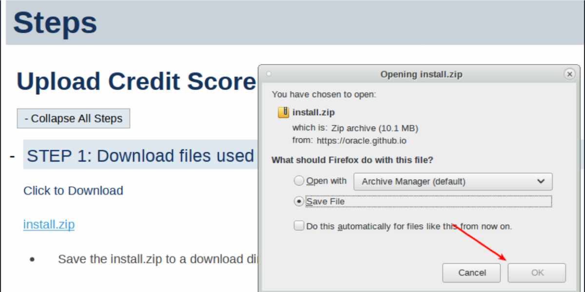

## **Step 5:** Create a bucket adwc and upload your data

- Select the drop down menu in the upper left, scroll down and select Object Storage.

  

- Create a bucket called `adwc`.  Create the bucket in your compartment (not ManagedCompartmentForPaas).

  

  

- Select the `adwc` bucket and upload file `credit_scoring_100k` in git directory `ADWC4Dev/workshops/adwc4dev/install`.

  

  

  

  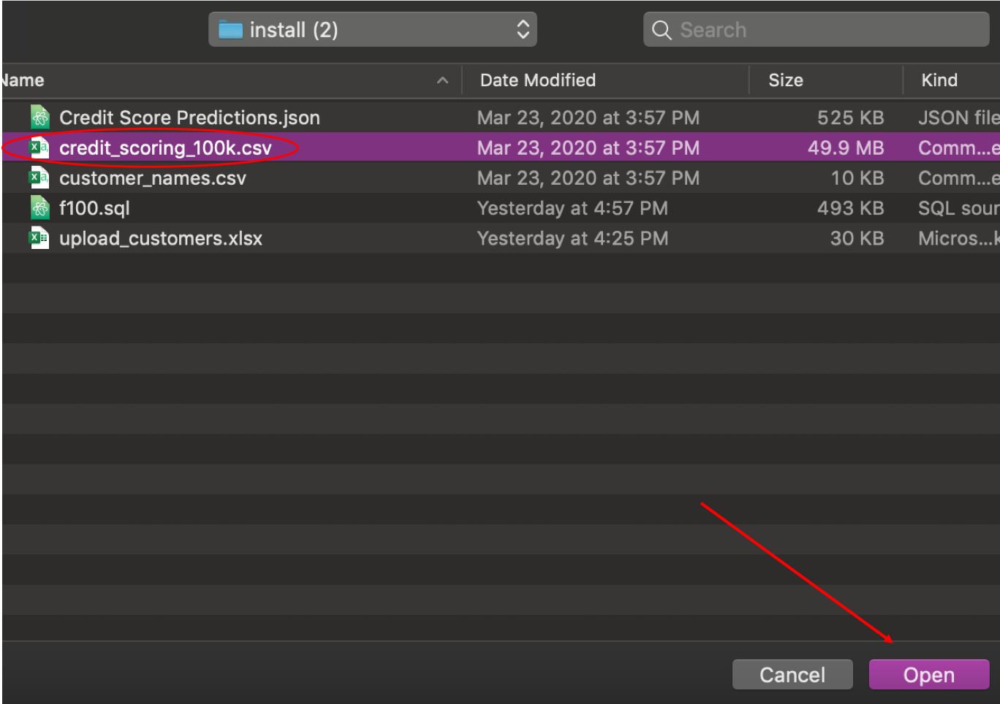

  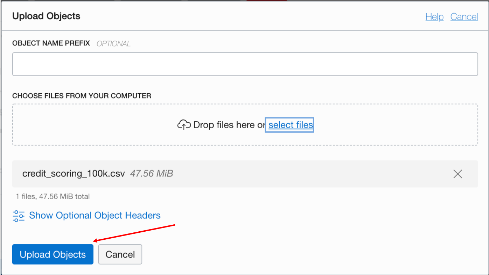

- Copy the URL Path to a notepad, we will need it later in this lab.

  

  

- We will also upload the cwallet.sso file from the wallet zip file we downloaded from the ADW Instance earlier. The cwallet.sso file will be used later, in Lab 3, but we will upload it now.


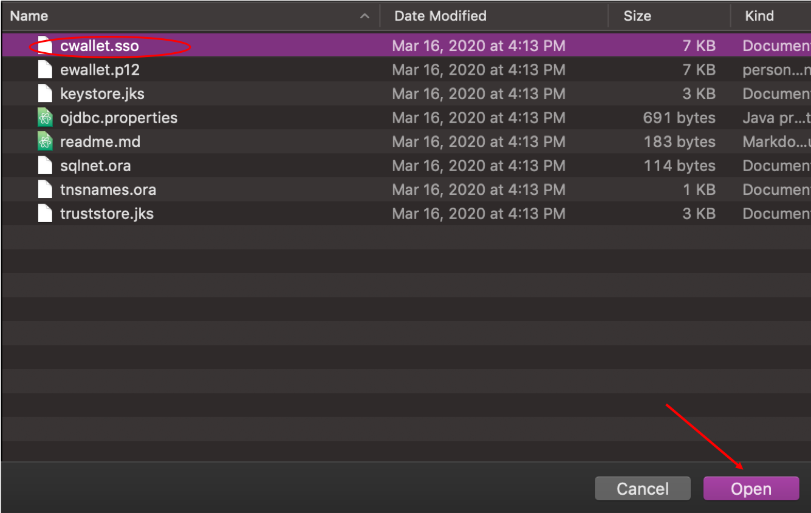

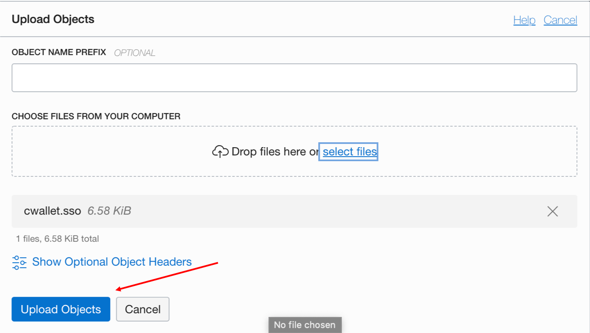


- To load data from the Oracle Cloud Infrastructure(OCI) Object Storage you will need an OCI user with the appropriate privileges to read data (or upload) data to the Object Store. The communication between the database and the object store relies on the Swift protocol and the OCI user Auth Token. Go back to the menu, click `Identity` and then select `Users`.

  

- Click the user's name to view the details. Also, remember the username as you will need it in the next step.

  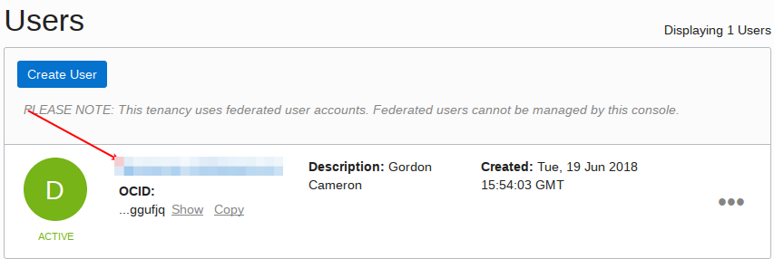

- On the left side of the page, click Auth Tokens, and then `Generate Token`.  Call it `adwc_token`. **Be sure to copy it to a notepad as you won't be able to see it again**.

  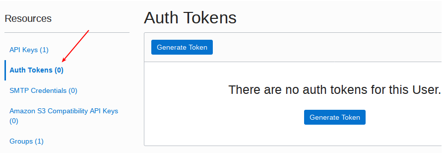

  

  

  


## **Step 6:** Log in to SQL Developer Web

- Next we will log into SQL Developer Web. Start by navigating to the ADW Instance page and clicking on `Service Console`

  

  

  

- Click on `Development`

  

- Select `SQL Developer Web`

  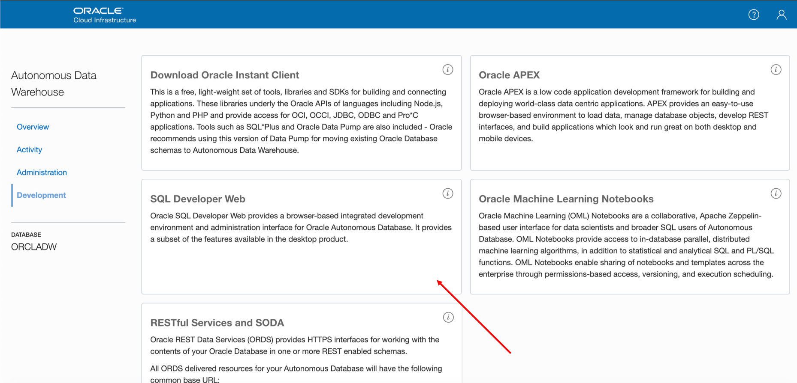

- Log in with `Username` `admin`, and with the  password you created for the ADW Instance back in Step 2.

  

## **Step 7:** Create a Database Credential for Your Users

- Log into SQL Develop Web from the your **ADW Instance**, your screen should look like the following:

  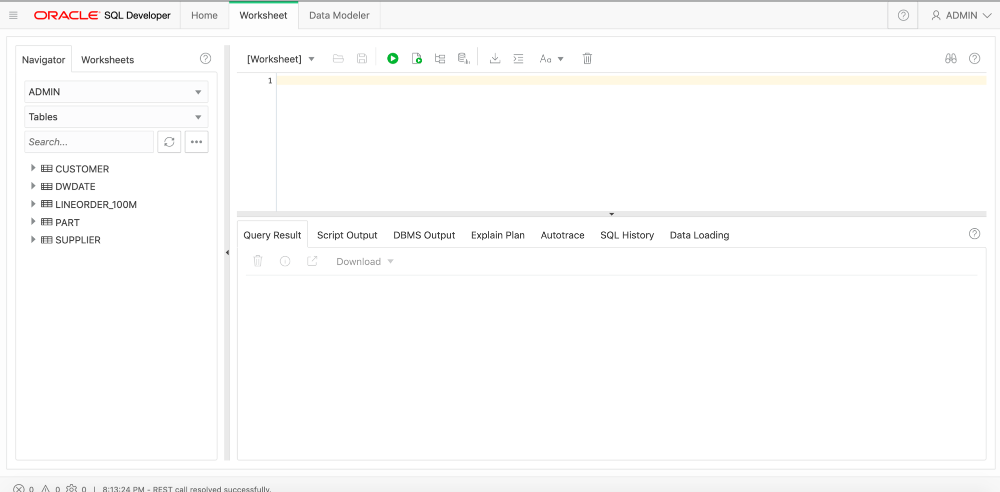

- To access data in the Object Store you have to enable your database user to authenticate itself with the Object Store using your OCI object store account and Auth token. You do this by creating a private CREDENTIAL object for your user that stores this information encrypted in your Autonomous Data Warehouse. This information is only usable for your user schema.

- Signed in to your SQL Developer Web, copy and paste this to SQL Developer worksheet. Specify the credentials for your Oracle Cloud Infrastructure Object Storage service: The username will be the OCI username (which is not the same as your database username) and the OCI object store Auth Token you generated in the previous step. In this example, the credential object named OBJSTORECRED is created. You reference this credential name in the following steps.

```
<copy>
BEGIN
  DBMS_CLOUD.CREATE_CREDENTIAL(
    credential_name => 'adwc_token',
    username => '&lt your cloud username &gt',
    password => '&lt generated auth token &gt'
  );
END;
/</copy>
```
  


- Now you are ready to load data from the Object Store.

## **Step 8:** Loading Data Using dbms\_cloud.copy_data package

- First, create your table. Enter the following in SQL Developer Web.

```
<copy>
create table admin.credit_scoring_100k
   (    customer_id number(38,0),
    age number(4,0),
    income number(38,0),
    marital_status varchar2(26 byte),
    number_of_liables number(3,0),
    wealth varchar2(4000 byte),
    education_level varchar2(26 byte),
    tenure number(4,0),
    loan_type varchar2(26 byte),
    loan_amount number(38,0),
    loan_length number(5,0),
    gender varchar2(26 byte),
    region varchar2(26 byte),
    current_address_duration number(5,0),
    residental_status varchar2(26 byte),
    number_of_prior_loans number(3,0),
    number_of_current_accounts number(3,0),
    number_of_saving_accounts number(3,0),
    occupation varchar2(26 byte),
    has_checking_account varchar2(26 byte),
    credit_history varchar2(26 byte),
    present_employment_since varchar2(26 byte),
    fixed_income_rate number(4,1),
    debtor_guarantors varchar2(26 byte),
    has_own_phone_no varchar2(26 byte),
    has_same_phone_no_since number(4,0),
    is_foreign_worker varchar2(26 byte),
    number_of_open_accounts number(3,0),
    number_of_closed_accounts number(3,0),
    number_of_inactive_accounts number(3,0),
    number_of_inquiries number(3,0),
    highest_credit_card_limit number(7,0),
    credit_card_utilization_rate number(4,1),
    delinquency_status varchar2(26 byte),
    new_bankruptcy varchar2(26 byte),
    number_of_collections number(3,0),
    max_cc_spent_amount number(7,0),
    max_cc_spent_amount_prev number(7,0),
    has_collateral varchar2(26 byte),
    family_size number(3,0),
    city_size varchar2(26 byte),
    fathers_job varchar2(26 byte),
    mothers_job varchar2(26 byte),
    most_spending_type varchar2(26 byte),
    second_most_spending_type varchar2(26 byte),
    third_most_spending_type varchar2(26 byte),
    school_friends_percentage number(3,1),
    job_friends_percentage number(3,1),
    number_of_protestor_likes number(4,0),
    no_of_protestor_comments number(3,0),
    no_of_linkedin_contacts number(5,0),
    average_job_changing_period number(4,0),
    no_of_debtors_on_fb number(3,0),
    no_of_recruiters_on_linkedin number(4,0),
    no_of_total_endorsements number(4,0),
    no_of_followers_on_twitter number(5,0),
    mode_job_of_contacts varchar2(26 byte),
    average_no_of_retweets number(4,0),
    facebook_influence_score number(3,1),
    percentage_phd_on_linkedin number(4,0),
    percentage_masters number(4,0),
    percentage_ug number(4,0),
    percentage_high_school number(4,0),
    percentage_other number(4,0),
    is_posted_sth_within_a_month varchar2(26 byte),
    most_popular_post_category varchar2(26 byte),
    interest_rate number(4,1),
    earnings number(4,1),
    unemployment_index number(5,1),
    production_index number(6,1),
    housing_index number(7,2),
    consumer_confidence_index number(4,2),
    inflation_rate number(5,2),
    customer_value_segment varchar2(26 byte),
    customer_dmg_segment varchar2(26 byte),
    customer_lifetime_value number(8,0),
    churn_rate_of_cc1 number(4,1),
    churn_rate_of_cc2 number(4,1),
    churn_rate_of_ccn number(5,2),
    churn_rate_of_account_no1 number(4,1),
    churn_rate__of_account_no2 number(4,1),
    churn_rate_of_account_non number(4,2),
    health_score number(3,0),
    customer_depth number(3,0),
    lifecycle_stage number(38,0),
    credit_score_bin varchar2(100 byte)
   );

grant select any table to public;</copy>
```
  

  - Click on the refresh button

  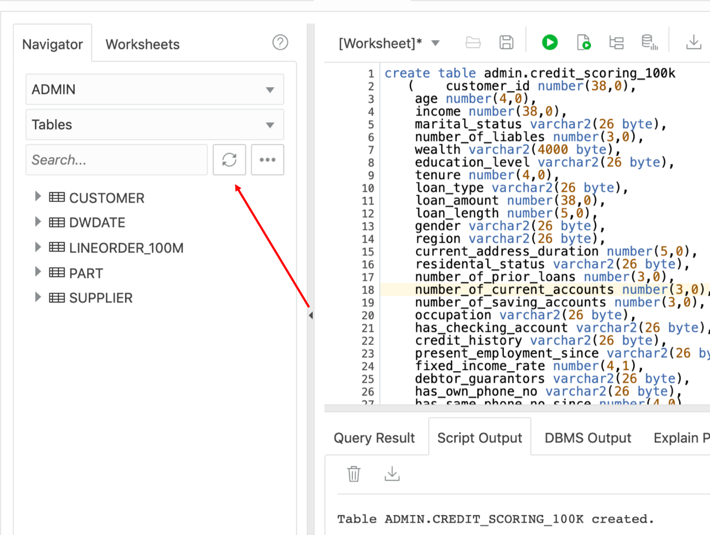

  - Enter the following code snippit and then execute. Make sure to replace the file_uri_list with the **URL Path** you copied earlier from the Bucket created in Object Storage.

  ```
  <copy>
  begin
   dbms_cloud.copy_data(
      table_name =>'credit_scoring_100k',
      credential_name =>'adwc_token',
      file_uri_list => 'https://objectstorage.<your data center - eg us-ashburn-1>/n/<your tenant - eg dgcameron2>/adwc/o/credit_scoring_100k.csv',
      format => json_object('ignoremissingcolumns' value 'true', 'removequotes' value 'true', 'dateformat' value 'YYYY-MM-DD HH24:MI:SS', 'blankasnull' value 'true', 'delimiter' value ',', 'skipheaders' value '1')
   );
  end;
  /</copy>
  ```
  

  - The data has been loaded. You have completed Lab 1 and are ready to move on to Lab 2.
