# Introduction and Setup

Lab 1 is all about getting your environment setup correctly. Here we will show you how to provision two different autonomous database instances, load data into object storage, and setup credentials and tools.

Simplifying greatly, you can split machine learning into two parts: the process of building and training a model so it is ready to work; putting that model to work in production systems, applications and processes.  In general, training a machine learning model takes significant compute resources. You should not run that kind of work in an existing data warehouse or data mart, without clearing it ahead of time because it’s possible that model training could use too many resources and impact SLAs. You definitely don’t want to build and train a model in any kind of critical transactional system for the same reason.

For this Alpha Office scenario we provision two different autonomous databases. The autonomous data warehouse is used to build and train your model. Think of it as a stand-in for your own data warehouse or data mart. Alternatively, given how easy it is to provision a data mart, think of this ADW as the best way for you to do machine learning without impacting anybody else in the organization. Setting up a dedicated data mart for machine learning, may be the right thing for you to do outside of this lab.

But it’s not just about training the model - you also have to deploy it, and there are some options. You could deploy a model into a data warehouse where it’s available for analytics. Or maybe you want to deploy it into a production transaction processing system so that you can score each new transaction. Either way, you are going to need to know how to export and import a model. So we show you that in this lab using two different databases.

What Alphaoffice want is to deploy this machine learning model in a production database that supports their Client Service application. When an existing customer comes in to the branch, we can pull up their name and check their credit in real time. The marketing department can also load batch data into this system and run a process to score a new set of customers in bulk. So in fact this setup of just two different services allows you to build, train and deploy a machine learning model into an application so that customer-facing and marketing employees can work with it.

## Objectives
-   Learn how to provision an ADWC instance
-   Learn how to provision an ATP instance
-   Learn how to connect to ADWC

## Required Artifacts
- The following lab requires an Oracle Public Cloud account. You may use your own cloud account, a cloud account that you obtained through a trial, or a training account whose details were given to you by an Oracle instructor.


**Note:** You may see differences in account details (eg: Compartment Name is different in different places) as you work through the labs.  This is because the workshop was developed using different accounts over time.

In this section you will be provisioning an ADWC database and an ATP database using the cloud console.

## **Step 1:** Sign in to Oracle Cloud

- Go to [cloud.oracle.com](https://cloud.oracle.com), click `View Accounts` to sign in with your Oracle Cloud account.

  

- Click `Sign in to Cloud` to sign in with your Oracle Cloud account.

  

- Enter your `Cloud Account Name` and click `Next`.

  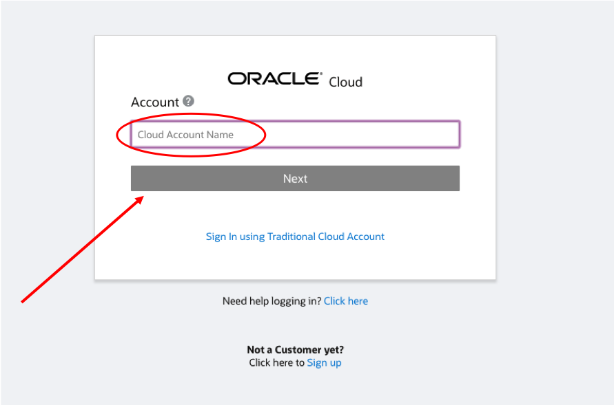

- Enter your Cloud `username` and `password`, and click `Sign In`.

  


## **Step 2:** Create an ADWC and ATP Instances

First, we are going to create an ADWC Instance:

- Search for Autonomous Data Warehouse and click on it

  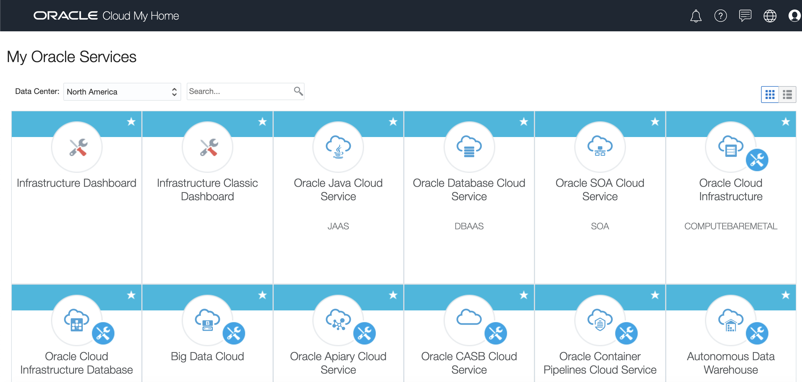


- Select Create Autonomous Data Warehouse

  

- Enter Select `Compartment` (yours will be different - do not select `ManagedCompartmentforPaaS`) and then enter `Display Name`, `Database Name`.

  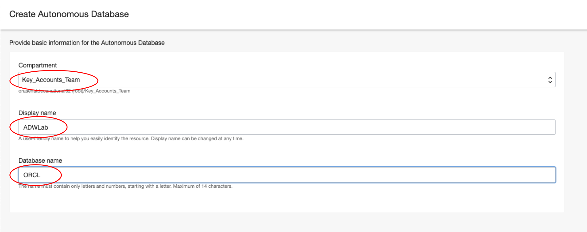

- Under `Choose a workload type` and `Choose a deployment type`, select `Data Warehouse` and `Shared Infrastructure`

  

- Under `Configure the database`, leave `Choose database version` and `Storage (TB)` as it is but increase `OCPU Count` to 2.

  

- Add a password. Note the password down in a notepad, you will need it later in Lab 2.

  


- Under `Choose a license type`, select   `License Included` and then select `Create Autonomous Database`.

  

- Once it finishes provisioning, you can click on the instance name to see details of it

  

  

You now have created your first Autonomous Data Warehouse Cloud instance. Now,
we are going to very similar steps to create an Autonomous DataBase

- Click on the side menu and select Autonoous Transaction processing

  

- Select Create Autonomous Database

  

  - Enter Select `Compartment` (yours will be different - do not select `ManagedCompartmentforPaaS`) and then enter `Display Name`, `Database Name`.

    

- Under `Choose a workload type` and `Choose a deployment type`, select `Transaction Processing` and `Shared Infrastructure`

    

- Under `Configure the database`, leave `Choose database version` and `Storage (TB)` as it is but increase `OCPU Count` to 2.

    

- Add a password. Note the password down in a notepad, you will need it later in Lab 2.

    


- Under `Choose a license type`, select   `Bring Your Own License (BYOL)` and then select `Create Autonomous Database`.

    

- Once it finishes provisioning, you can click on the instance name to see details of it

    

    

You now have created your first Autonomous Database Cloud instance.

## **Step 3:** Download the credentials wallet

- Click the menu bar and navigate to the ADW Instance you created in Step 2.

    

    

- In the instance details page find your database and click Service Console.

    

- Click on `Administration` and click `Download a Connection Wallet`

    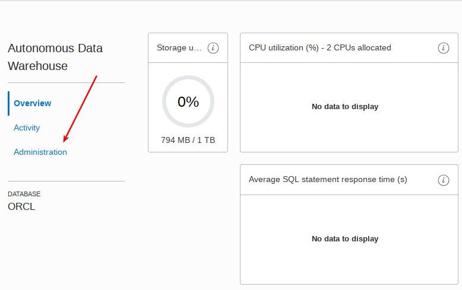

    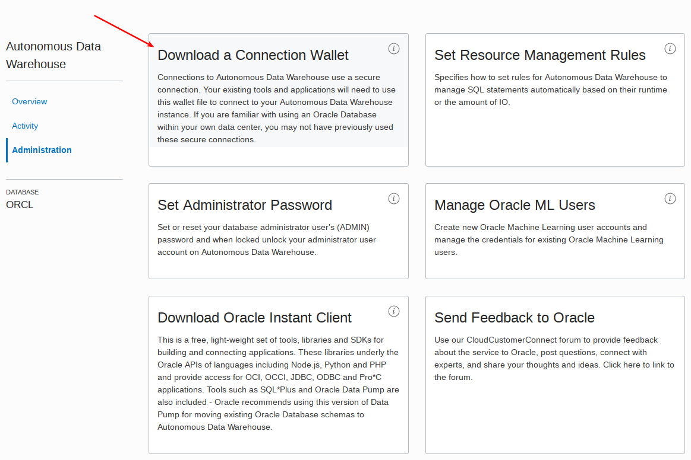

- Specify a password of your choice for the wallet. You will need this password when connecting to the database later. Click Download to download the wallet file to your client machine

    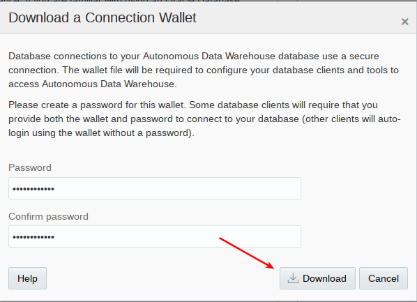

- Unzip the the downloaded wallet file, note the cwallet.sso file, you will need it later in this lab.

    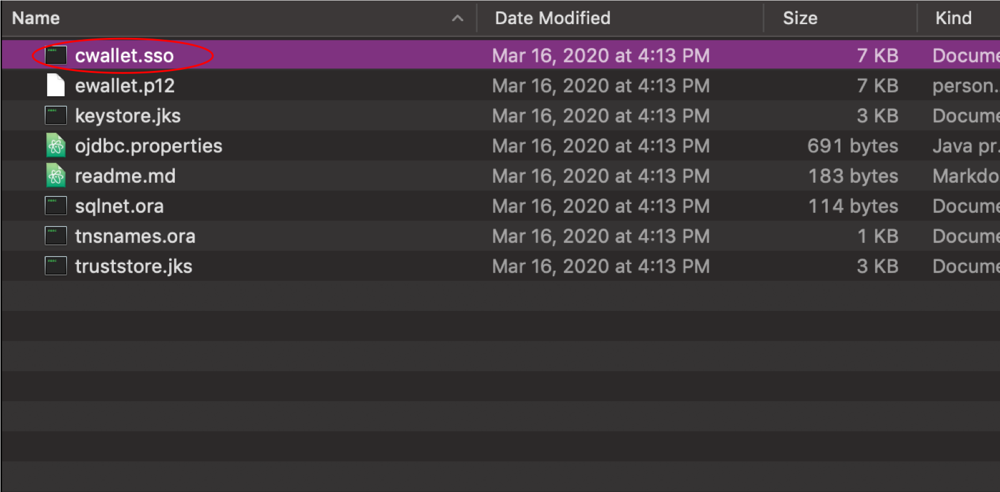

## **Step 4:** Download Files Used in Lab 200

**Click to Download**

[install.zip](install/install.zip)

- Save the install.zip to a download directory and then unzip the file.

  

## **Step 5:** Create a bucket adwc and upload your data

- Select the drop down menu in the upper left, scroll down and select Object Storage.

  

- Create a bucket called `adwc`.  Create the bucket in your compartment (not ManagedCompartmentForPaas).

  

  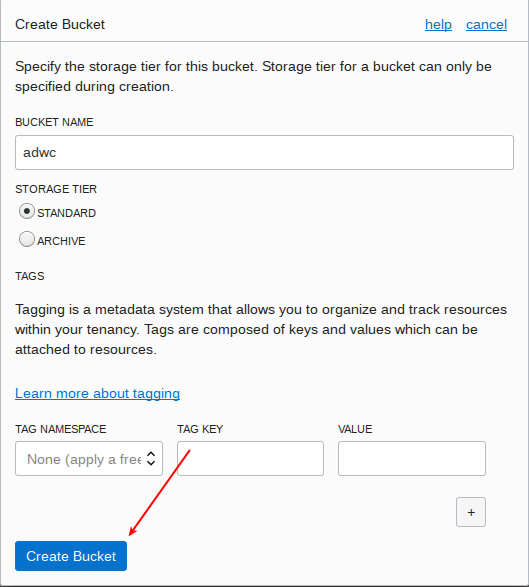

- Select the `adwc` bucket and upload file `credit_scoring_100k` in git directory `ADWC4Dev/workshops/adwc4dev/install`.

  

  

  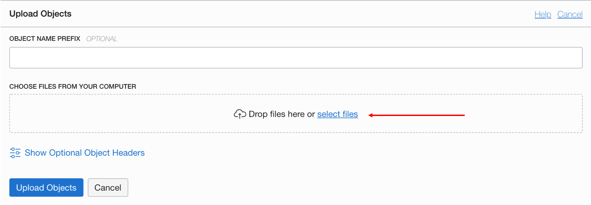

  

  

- Copy the URL Path to a notepad, we will need it later in this lab.

  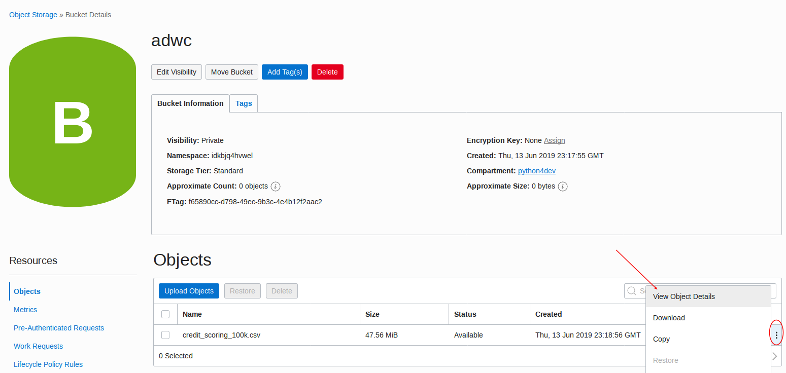

  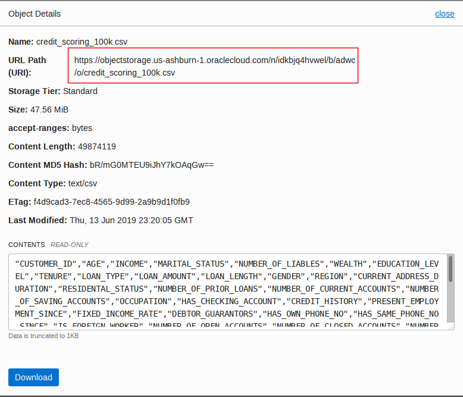

- We will also upload the cwallet.sso file from the wallet zip file we downloaded from the ADW Instance earlier. The cwallet.sso file will be used later, in Lab 3, but we will upload it now.


- To load data from the Oracle Cloud Infrastructure(OCI) Object Storage you will need an OCI user with the appropriate privileges to read data (or upload) data to the Object Store. The communication between the database and the object store relies on the Swift protocol and the OCI user Auth Token. Go back to the menu, click `Identity` and then select `Users`.

  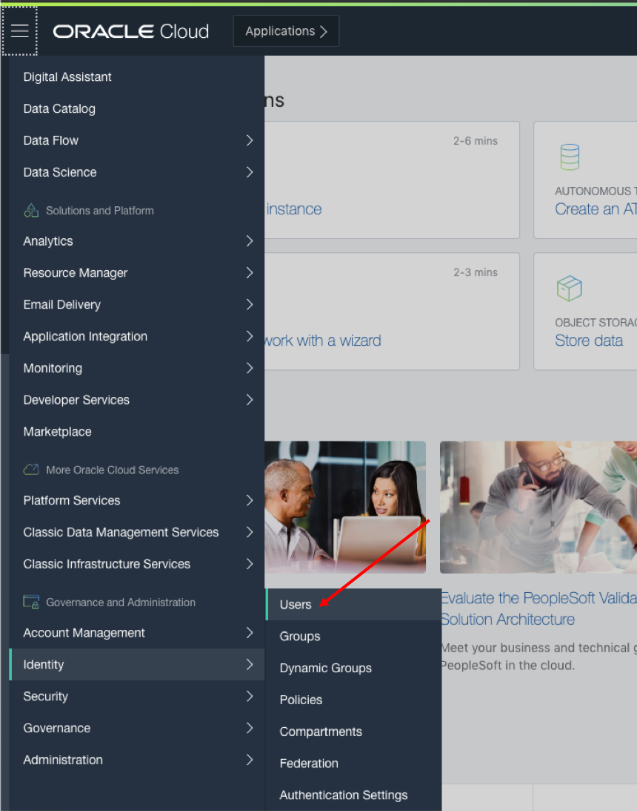

- Click the user's name to view the details. Also, remember the username as you will need it in the next step.

  

- On the left side of the page, click Auth Tokens, and then `Generate Token`.  Call it `adwc_token`. **Be sure to copy it to a notepad as you won't be able to see it again**.

  

  

  

  


## **Step 6:** Log in to SQL Developer Web

- Next we will log into SQL Developer Web. Start by navigating to the ADW Instance page and clicking on `Service Console`

  

  

  

- Click on `Development`

  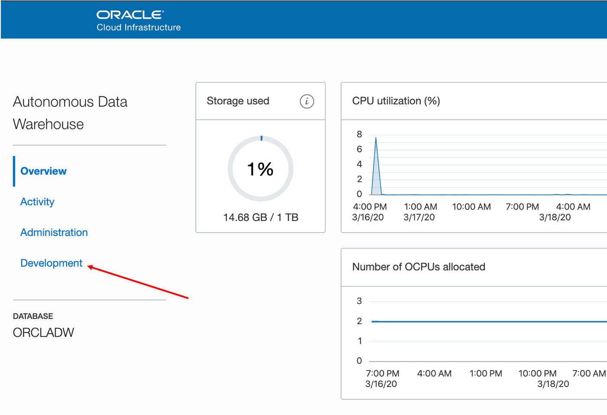

- Select `SQL Developer Web`

  

- Log in with `Username` `admin`, and with the  password you created for the ADW Instance back in Step 2.

  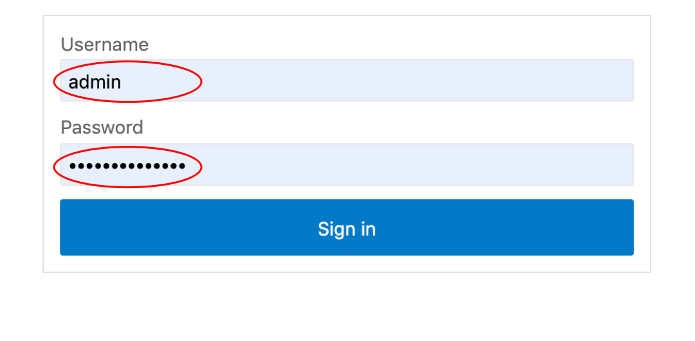

## **Step 7:** Create a Database Credential for Your Users

- Log into SQL Develop Web from the your **ADW Instance**, your screen should look like the following:

  

- To access data in the Object Store you have to enable your database user to authenticate itself with the Object Store using your OCI object store account and Auth token. You do this by creating a private CREDENTIAL object for your user that stores this information encrypted in your Autonomous Data Warehouse. This information is only usable for your user schema.

- Signed in to your SQL Developer Web, copy and paste this to SQL Developer worksheet. Specify the credentials for your Oracle Cloud Infrastructure Object Storage service: The username will be the OCI username (which is not the same as your database username) and the OCI object store Auth Token you generated in the previous step. In this example, the credential object named OBJSTORECRED is created. You reference this credential name in the following steps.

```
<copy>
BEGIN
  DBMS_CLOUD.CREATE_CREDENTIAL(
    credential_name => 'adwc_token',
    username => '&lt your cloud username &gt',
    password => '&lt generated auth token &gt'
  );
END;
/</copy>
```
  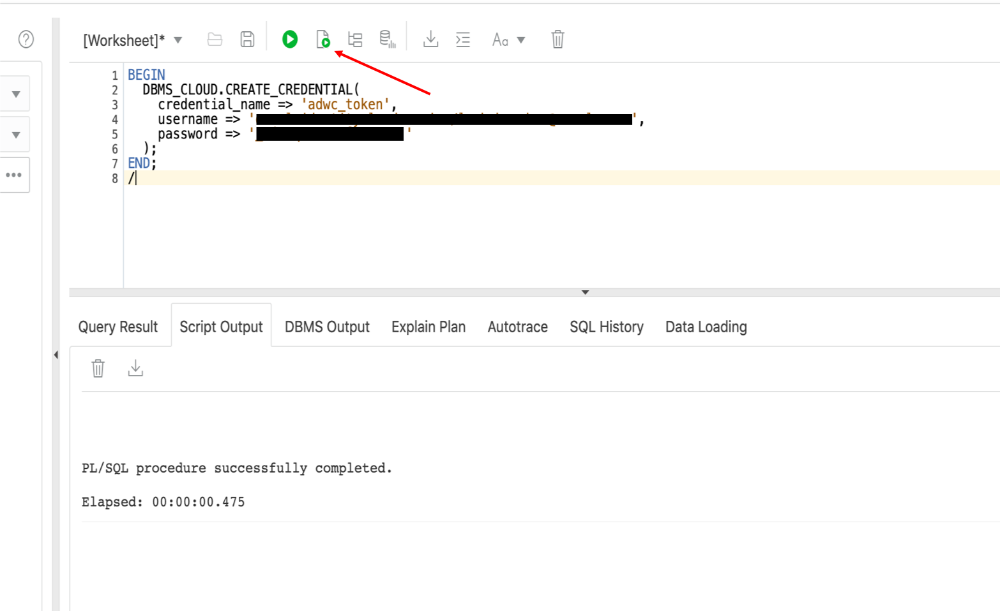


- Now you are ready to load data from the Object Store.

## **Step 8:** Loading Data Using dbms\_cloud.copy_data package

- First, create your table. Enter the following in SQL Developer Web.

```
<copy>
create table admin.credit_scoring_100k
   (    customer_id number(38,0),
    age number(4,0),
    income number(38,0),
    marital_status varchar2(26 byte),
    number_of_liables number(3,0),
    wealth varchar2(4000 byte),
    education_level varchar2(26 byte),
    tenure number(4,0),
    loan_type varchar2(26 byte),
    loan_amount number(38,0),
    loan_length number(5,0),
    gender varchar2(26 byte),
    region varchar2(26 byte),
    current_address_duration number(5,0),
    residental_status varchar2(26 byte),
    number_of_prior_loans number(3,0),
    number_of_current_accounts number(3,0),
    number_of_saving_accounts number(3,0),
    occupation varchar2(26 byte),
    has_checking_account varchar2(26 byte),
    credit_history varchar2(26 byte),
    present_employment_since varchar2(26 byte),
    fixed_income_rate number(4,1),
    debtor_guarantors varchar2(26 byte),
    has_own_phone_no varchar2(26 byte),
    has_same_phone_no_since number(4,0),
    is_foreign_worker varchar2(26 byte),
    number_of_open_accounts number(3,0),
    number_of_closed_accounts number(3,0),
    number_of_inactive_accounts number(3,0),
    number_of_inquiries number(3,0),
    highest_credit_card_limit number(7,0),
    credit_card_utilization_rate number(4,1),
    delinquency_status varchar2(26 byte),
    new_bankruptcy varchar2(26 byte),
    number_of_collections number(3,0),
    max_cc_spent_amount number(7,0),
    max_cc_spent_amount_prev number(7,0),
    has_collateral varchar2(26 byte),
    family_size number(3,0),
    city_size varchar2(26 byte),
    fathers_job varchar2(26 byte),
    mothers_job varchar2(26 byte),
    most_spending_type varchar2(26 byte),
    second_most_spending_type varchar2(26 byte),
    third_most_spending_type varchar2(26 byte),
    school_friends_percentage number(3,1),
    job_friends_percentage number(3,1),
    number_of_protestor_likes number(4,0),
    no_of_protestor_comments number(3,0),
    no_of_linkedin_contacts number(5,0),
    average_job_changing_period number(4,0),
    no_of_debtors_on_fb number(3,0),
    no_of_recruiters_on_linkedin number(4,0),
    no_of_total_endorsements number(4,0),
    no_of_followers_on_twitter number(5,0),
    mode_job_of_contacts varchar2(26 byte),
    average_no_of_retweets number(4,0),
    facebook_influence_score number(3,1),
    percentage_phd_on_linkedin number(4,0),
    percentage_masters number(4,0),
    percentage_ug number(4,0),
    percentage_high_school number(4,0),
    percentage_other number(4,0),
    is_posted_sth_within_a_month varchar2(26 byte),
    most_popular_post_category varchar2(26 byte),
    interest_rate number(4,1),
    earnings number(4,1),
    unemployment_index number(5,1),
    production_index number(6,1),
    housing_index number(7,2),
    consumer_confidence_index number(4,2),
    inflation_rate number(5,2),
    customer_value_segment varchar2(26 byte),
    customer_dmg_segment varchar2(26 byte),
    customer_lifetime_value number(8,0),
    churn_rate_of_cc1 number(4,1),
    churn_rate_of_cc2 number(4,1),
    churn_rate_of_ccn number(5,2),
    churn_rate_of_account_no1 number(4,1),
    churn_rate__of_account_no2 number(4,1),
    churn_rate_of_account_non number(4,2),
    health_score number(3,0),
    customer_depth number(3,0),
    lifecycle_stage number(38,0),
    credit_score_bin varchar2(100 byte)
   );

grant select any table to public;</copy>
```
  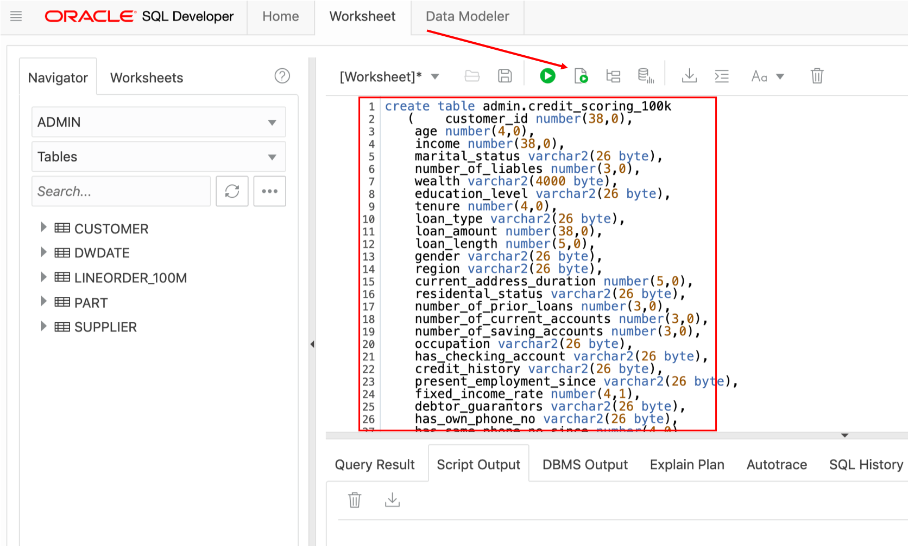

  - Click on the refresh button

  

  - Enter the following code snippit and then execute. Make sure to replace the file_uri_list with the **URL Path** you copied earlier from the Bucket created in Object Storage.

  ```
  <copy>
  begin
   dbms_cloud.copy_data(
      table_name =>'credit_scoring_100k',
      credential_name =>'adwc_token',
      file_uri_list => 'https://objectstorage.<your data center - eg us-ashburn-1>/n/<your tenant - eg dgcameron2>/adwc/o/credit_scoring_100k.csv',
      format => json_object('ignoremissingcolumns' value 'true', 'removequotes' value 'true', 'dateformat' value 'YYYY-MM-DD HH24:MI:SS', 'blankasnull' value 'true', 'delimiter' value ',', 'skipheaders' value '1')
   );
  end;
  /</copy>
  ```
  

  - The data has been loaded. You have completed Lab 1 and are ready to move on to Lab 2.
