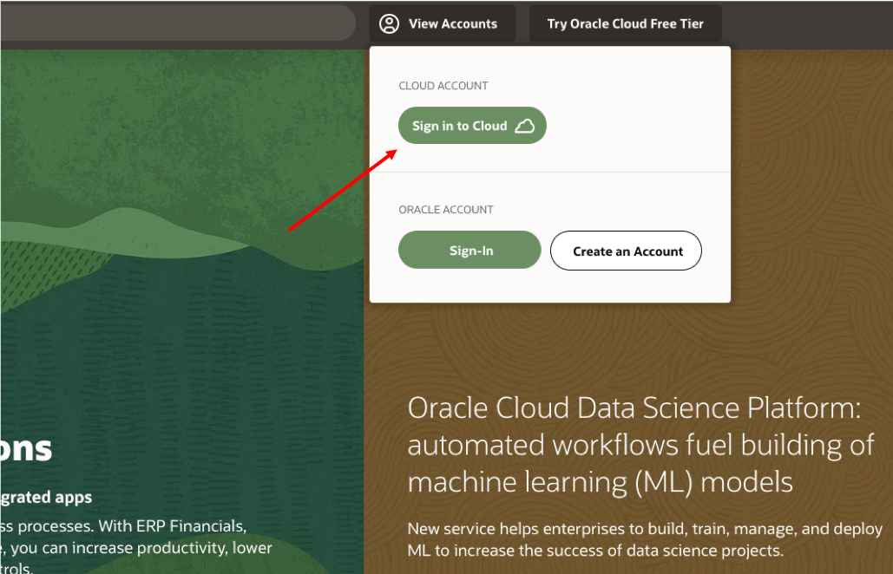
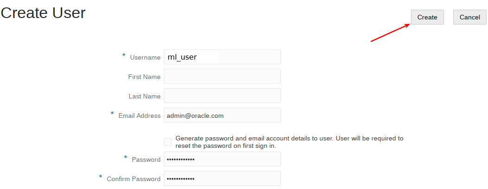
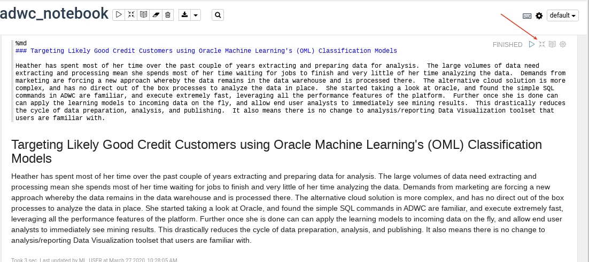
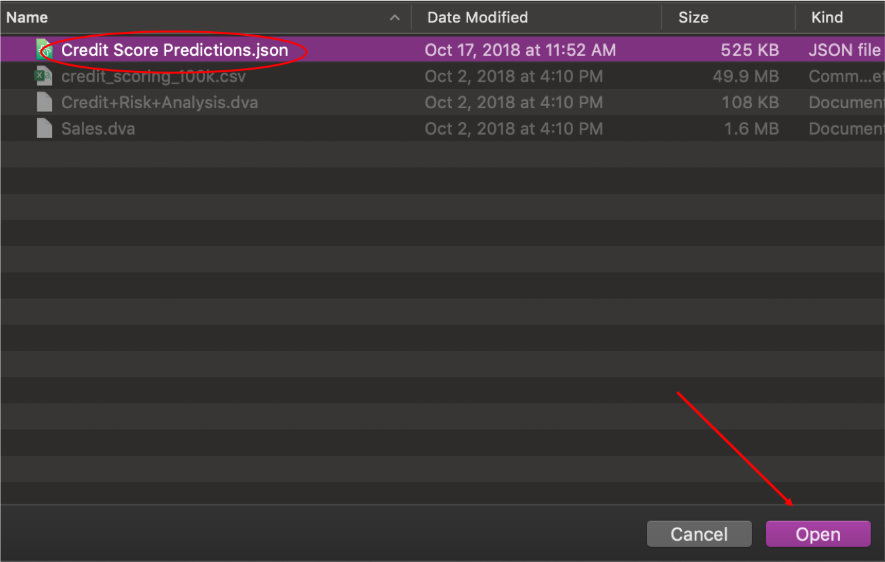

# Machine Learning

## Backgound Challenges

In this lab you will assume the persona of Heather, the data scientist/ML expert for Alphaoffice. In the last lab, we set up all the necessary SQL commands in the SQL Developer Web so that now we can apply learning models to the incoming data.

An added benefit is the ability to use a new open source [Apache Zeppelin based collaboration environment](http://www.oracle.com/technetwork/database/options/oml/overview/index.html) where Heather can work with others on the team in real time, annotating ML steps and combining the processing and documentation in one place.  Since we are going to use Oracle ML interface, much of the lab will be done in that interface.  For more information on which Machine Learning Algorithms are supported see [Oracle Advanced Analytics documentation](https://docs.oracle.com/en/database/oracle/oracle-database/12.2/dmapi/mining-fuctions.html#GUID-3BC8FD92-9B6A-4612-A458-7E5FFDDC5EA7).

To log issues and view the Lab Guide source, go to the [github oracle](https://github.com/oracle/learning-library/tree/master/workshops/adwc4dev) repository.

## Objectives

- Import a Apache Zepplin notebook.
- Become familiar with Oracle Machine Learning Algorithms.
- Create a machine learning model to determine factors that predict good credit.

## **Step 1:** Sign in to Oracle Cloud

- Log in, if you have not already done so.

## **Step 2:** Create ML User

- Navigate to your ADW Instance

- Select `Scale Up/Down`

- Select Administration

- Select `Manage Oracle ML Users.`

- Login as admin user and password that you assigned when you created the instance (admin/Alpha2018___)

- Create a new ML user. Enter user `adwc_ws` with password Alpha2018___.

## **Step 2:** Create ML Notebook

- Select the home icon upper right.

- Log in as adwc_ws password Alpha2018___. Before you log in, you may wish to bookmark this page.

- Navigate around to get familiar with the ML pages. Click on  `Examples.`

- Note the various ML notebook examples. Feel free to review some of these. We will be creating a new ML notebook in this lab.

- Click on the upper left icon to bring back the menu. Then select `Notebooks.`

- We will create a notebook from the beginning, select `Create.`

- Enter `adwc_notebook` as the name, the click `OK`.

## **Step 2:** Import ML Notebook

- Now we have finished creating a ML notebook from scratch, let's import a pre-built notebook and use it for the remainder of the this lab.

- Navigate back to the Notebook page

- We will be importing a pre-built notebook, and using this for the remainder of the lab. Select `Import`.

- Go to the install directory in your git repository and import `Credit Score Predictons.json` notebook.

- Select the `Credit Score Predictions` notebook.

- Before you start working the `Credit Score Predictions` you need to set the interpreter binging. Click on the gear icon. 
