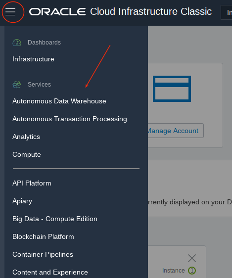
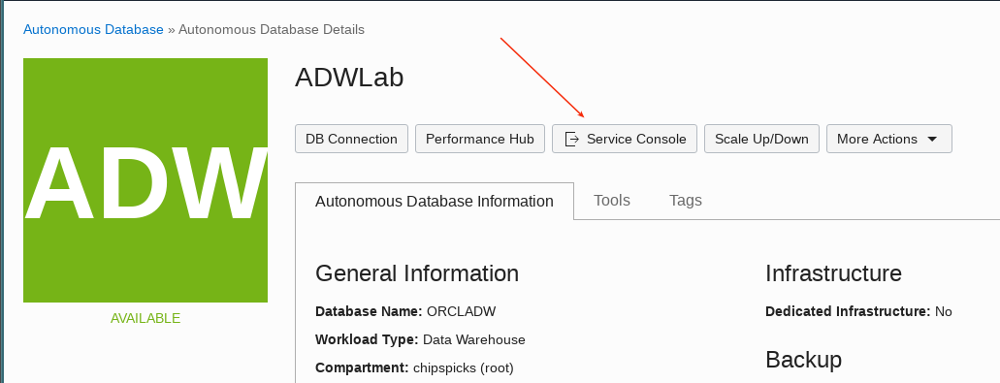
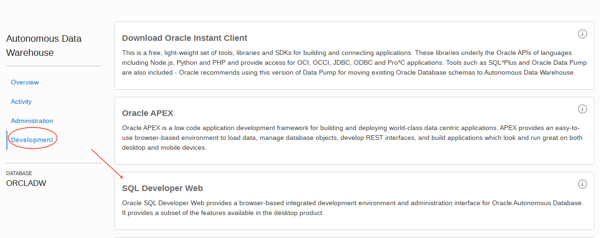
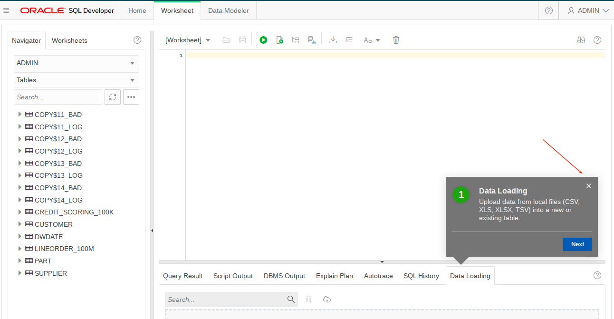

# Creating the Machine Learning Model

## Introduction

In this lab, you will:

- In ADW:
  - Log into SQL Developer Web and enable user ml_user access to sqldeveloper web.
  - Grant storage priviledges to ml_user
  - Log in with ml_user and export the model to a temporary table.
- In ATP:
  - Create a database link that will be used to copy (pull) an export of the ml model from ADW to ATP.
  - Create a new ml_user and grant that user access to sqldeveloper web, and to storage.
  - Copy the model from ADW to ATP.
  - Log in with ml_user and import the ml model.
  - Create a virtual column on the table that applies the model to rows in the table.

## **Step 1:** Sign in to Oracle Cloud

- Log in, if you have not already done so.

  

- Navigate to Autonomous Data Warehouse and then select your ADW instance.

  

  

- Select the Service Console.

  

- Select Development, and then SQL Developer Web.

  

- Log in with your adw admin userid and password.

  

- Close the popup help notes.

  

- By default only the admin userid can use SQL Developer Web.  To enable ml_user to use it, you need to enable this.  Enter the following and execute the procedure to grant sqldeveloper web access to ml_user.
```
<copy>BEGIN
   ORDS_ADMIN.ENABLE_SCHEMA(
     p_enabled => TRUE,
     p_schema => 'ML_USER',
     p_url_mapping_type => 'BASE_PATH',
     p_url_mapping_pattern => 'ml_user',
     p_auto_rest_auth => TRUE
   );
   COMMIT;
END;
/</copy>
```

  

  