# Using Prediction in an Application

## Introduction

In this lab, you will:

- Import data to set up the lab.
- Import an APEX application.
- Review the application to see how you can make predictions on the fly.
- Expose your ml model as a REST end point so any application can use it.

## **Step 1:**Prep data for the lab.

- To show how an application would use ml predictions we'll add some customer names to the original credit_scoring_100k data set.  Navigate to the SQL Developer Web and log in with ml_user (if you are not already logged in from the previous lab).  Then select file upload on the left.

  

- Select the files button, and then the customer_names.csv file in the install directory.

  

- Accept the defaults and hit next.

  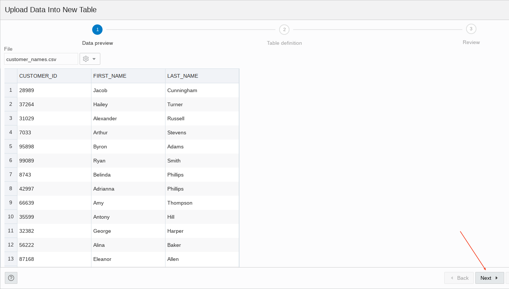

- Change the customer\_id data type to number and change the lengths.

  

- Accept the remaining defaults.

  

- Create a view that combines the names with the credit_scoring_100k data set.
```
<copy>create or replace view ml_user.credit_scoring_100k_v as select a.first_name, a.last_name, b.*
from ml_user.customer_names a, credit_scoring_100k b
where a.customer_id(+)= b.customer_id;</copy>
```

  

- Create a new upload\_customers table.  This will be used in the application to show how newly loaded records can be scored on the fly.
```
<copy>create table upload_customers (
customer_id number
, first_name varchar2(100)
, last_name varchar2(100)
, wealth varchar2(4000)
, income number
, customer_dmg_segment varchar2(26)
, customer_value_segment varchar2(26)
, occupation varchar2(26)
, highest_credit_card_limit number
, delinquency_status varchar2(26)
, max_cc_spent_amount number
, max_cc_spent_amount_prev number
, residental_status varchar2(26)
, likely_good_credit_pcnt AS (round((100*(prediction_probability(n1_class_model, 'Good Credit' USING 
    wealth
  , customer_dmg_segment
  , income
  , highest_credit_card_limit
  , residental_status
  , max_cc_spent_amount_prev
  , max_cc_spent_amount
  , occupation
  , delinquency_status
  , customer_value_segment
  , residental_status))),1))
, credit_prediction AS (prediction(n1_class_model USING   
  wealth
  , customer_dmg_segment
  , income
  , highest_credit_card_limit
  , residental_status
  , max_cc_spent_amount_prev
  , max_cc_spent_amount
  , occupation
  , delinquency_status
  , customer_value_segment
  , residental_status))
);</copy>
```

  

## **Step 2:**Import the APEX Application

- Navigate to the ATP APEX application through the ATP Service Console.

  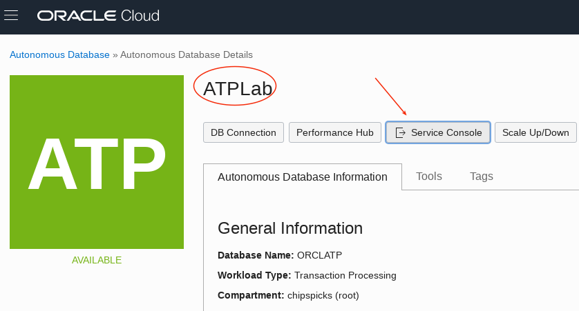

- Select Development, then APEX.

  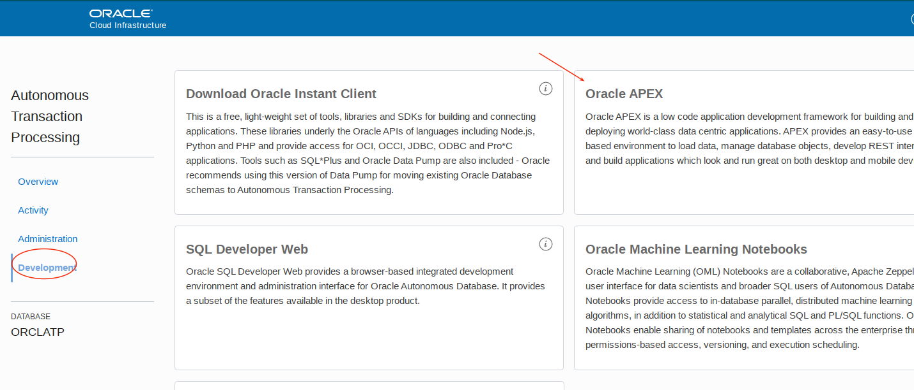

- Enter your admin password.

  

- You will be prompted to create a workspace. 

  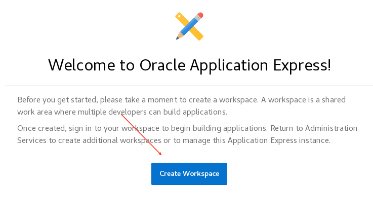

- Select ML_USER for the workspace user and enter ML_APPLICATION for the workspace name.

  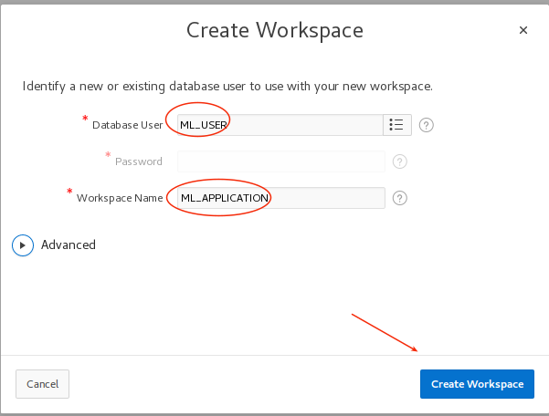

  

- Sign out of user admin and log in with workspace ML_APPLICATION and user ML_USER.

  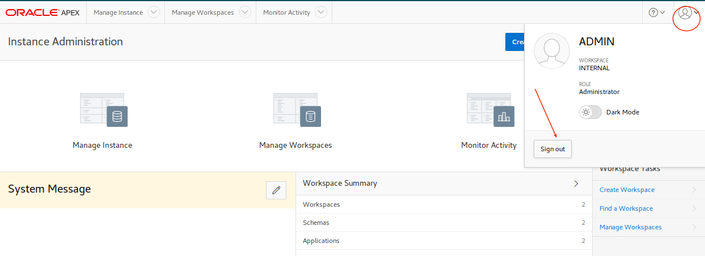

  

   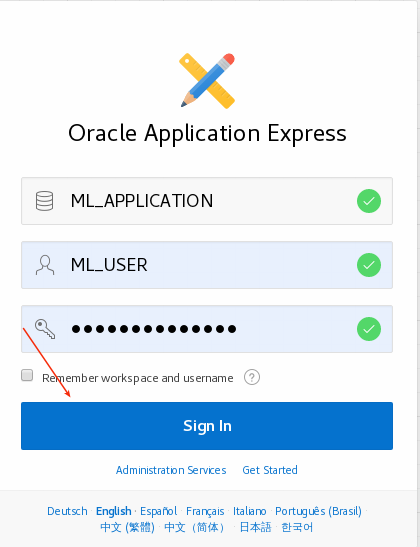

- You will be prompted to set the new application password for ml_user.  Make the email proper (not necessarily valid) and accept defaults.

   

   

- Select App Builder.

   

- Select Import

   

- Select choose file, and then select the f101.sql file in the git repo and then accept the defaults.

   

   

   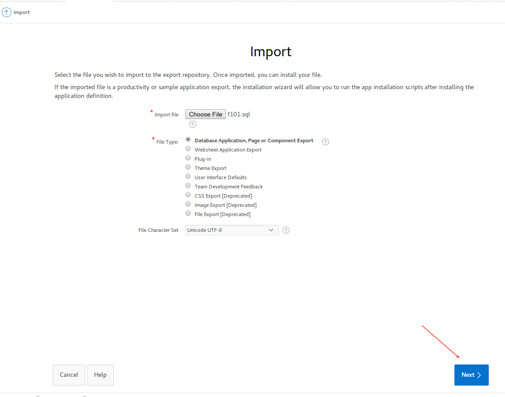

   

   

   

   

   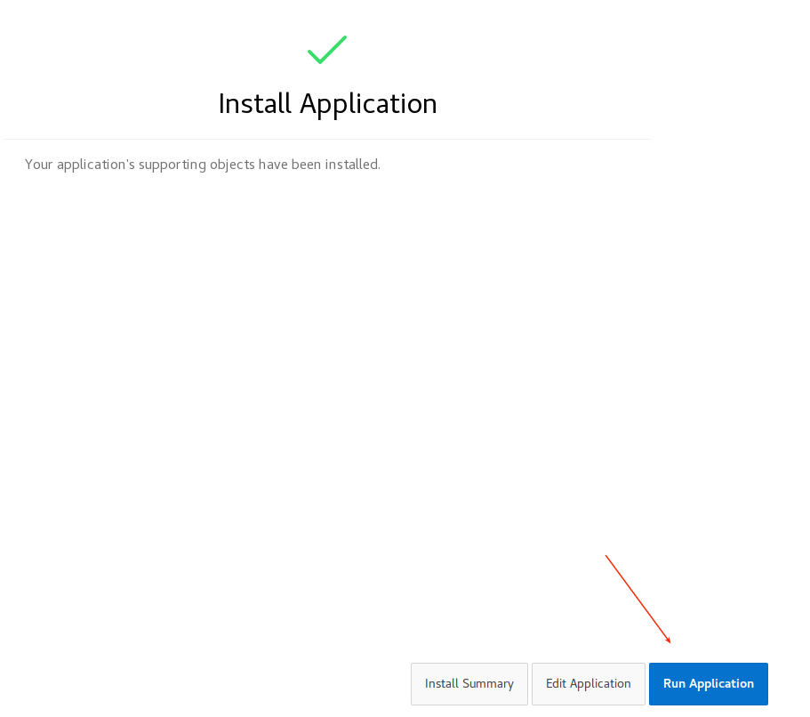

- Log in as ml_user.

   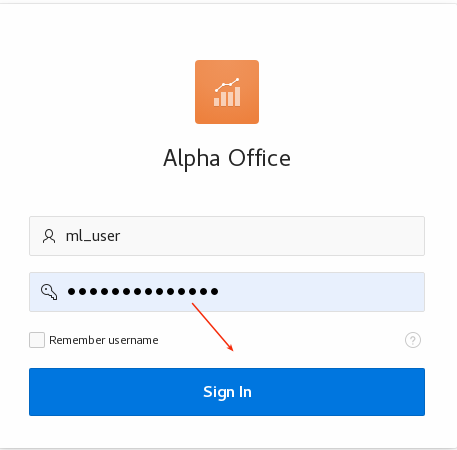

   

## **Step 3:**Run application and review on-the-fly prediction/scoring.

- Select Customer Walk-in from the menu.  Select last name and then first name.  Note the credit score prediction and the probability of that estimate.  These calculations are done as the data is queried.

   

-  Next we will upload new customers and score those as a batch.  Select the Home menu item at the bottom of the page.

   

- Select SQL Workshop.

   

- Select Utilities.

   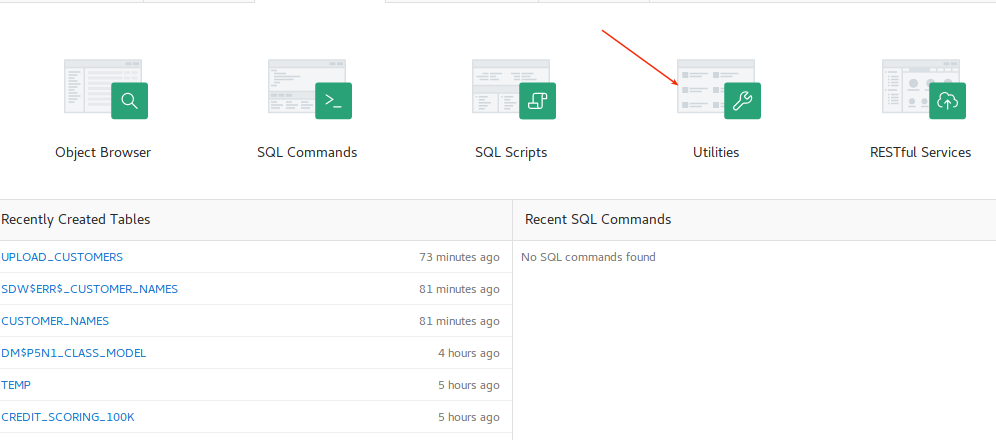

- Select Data Workshop.

   

- Select Load Data.

   

- Select the upload_customers.xlsx file.

   

- Load to existing table upload_customers.

   

   

- Return to the Alpha Office application.

   

   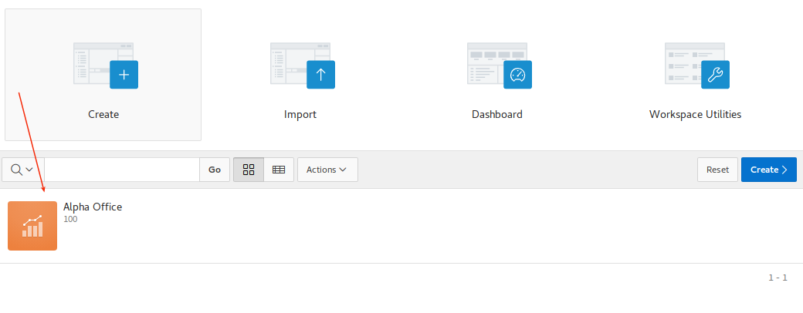

- Run the application

   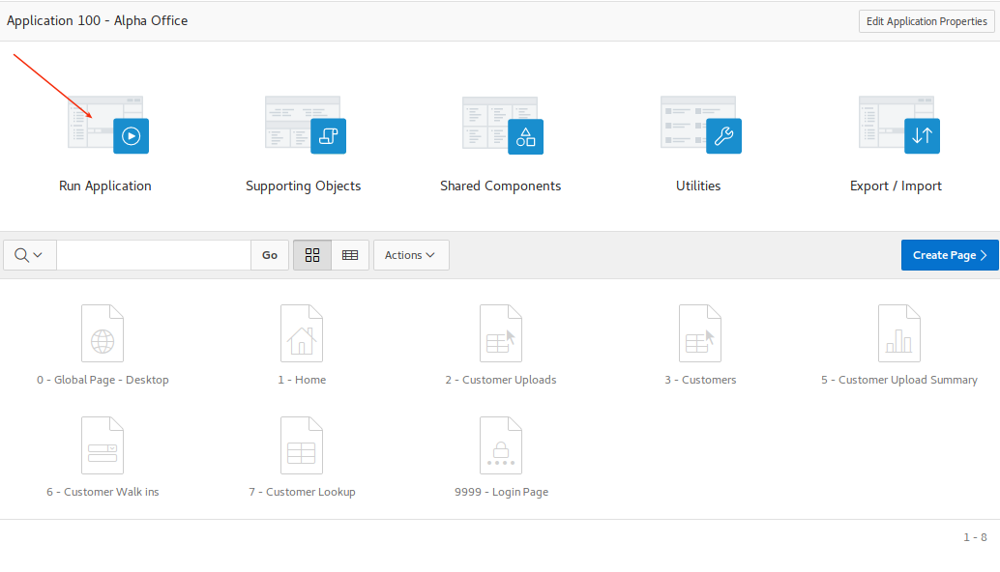

- Now review the uploaded customers and note the predictions.

   

- Select Customer Upload Summary.  This provides a summary measure of the uploaded customer number of new good credit versus other credit customers.

   

- Select Overall Credit Profile.  This provides an overall measure of the credit across the entire 100k credit database.  This scoring of 100k customers with 10 variables takes less than a second.

   

## **Step 4:**Expose the ml model as a REST end point so any application can call it.

- Select the Home button at the bottom of the screen.

   

- Select SQL Workshop.

   

- Select RESTFul Services.

   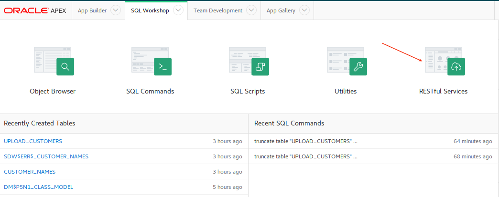

- Select Module on the left, then Create Module.

   

- Enter the following
    - Module Name - `Predict Credit`
    - Base Path - `/credit/`

  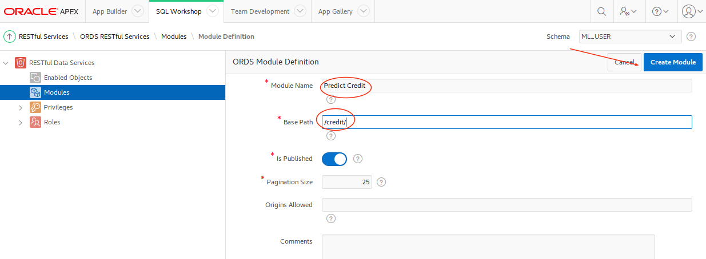

- Next create a Template.

   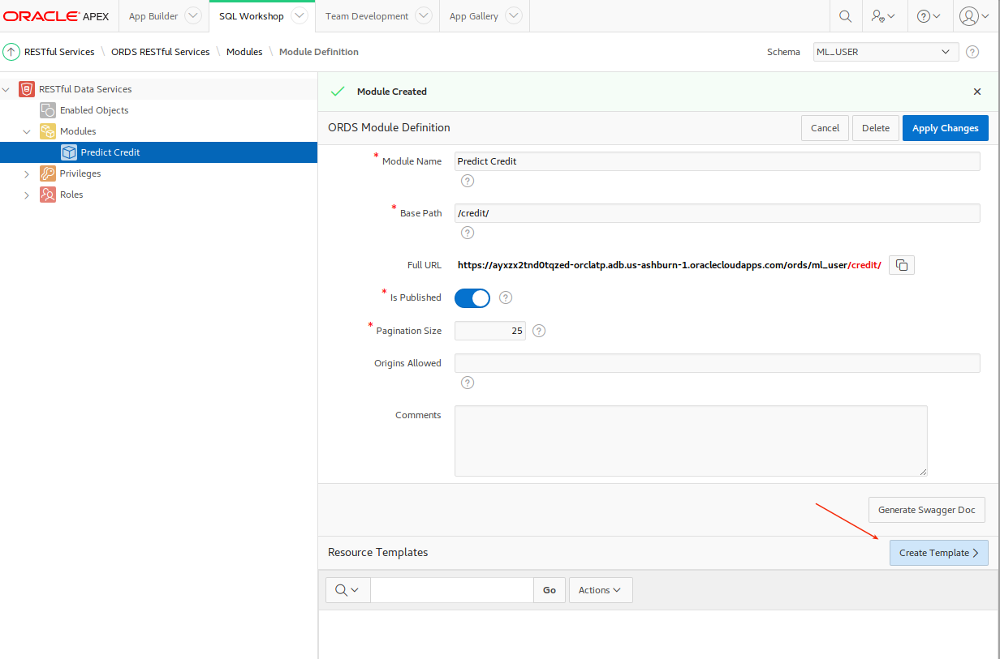

- Enter the following:
    - URI Template: `credit_scoring_100k_v/:wealth/:income`

   

- Next create a handler.  Be sure to select Query one row, and enter the following sql query and select Create Handler.
    - `select prediction(n1_class_model using :wealth as wealth, :income as income) credit_prediction from dual`

   

   

   

- Copy the URL and paste into your browser, and then replace the parameters :wealth and :income with Rich and 20000 respectively.  We are passing the wealth and income variables to the prediction model.  Note these are just two of the many variables we could pass to the model (just add additional ones).  After changing the URL just hit enter.

   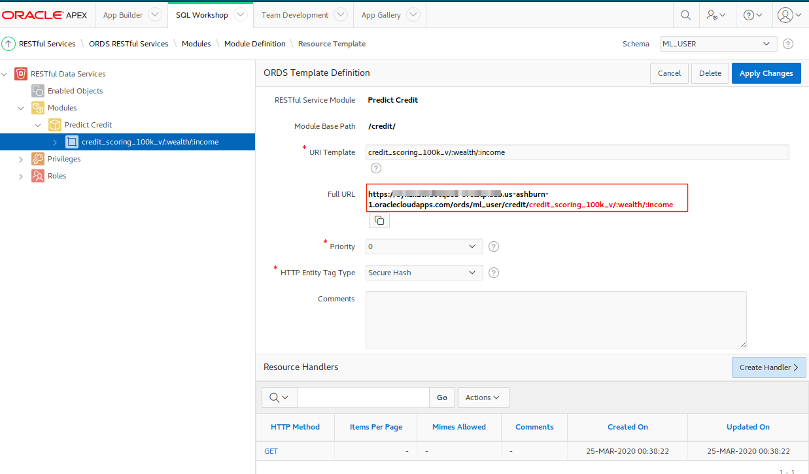

   

This concludes this lab and the workshop.